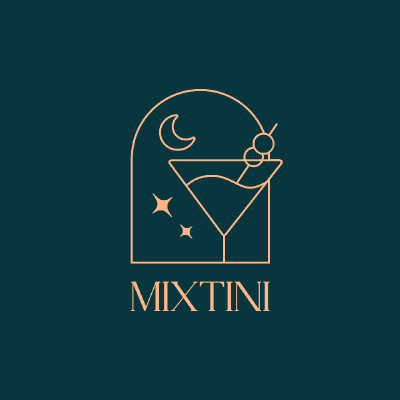

# cocktails-guide-book

A POC cocktails search portal created by [Mixtini](https://www.instagram.com/mixtini.co).

This service is the version for `Proof of Concept`. The official version is working in progress and can be visited by the same URL path.

<b>User Guide</b>

* [User Guide](doc/USER-GUIDE.md)

<b>Dev Doc</b>

* [Design Doc](doc/DESIGN.md)
* [Database Doc](doc/DATABASE-DOC.md)
* [Development Doc](doc/DEVELOPMENT.md)

<b>Portal</b>

* [Mixtini Cocktails Search Portal](https://overpartylab-4c6d2.web.app/)

## Env Introduction

We use firebase service to development our service.
* Web host: firebase hosting
* ~~Firebase functions and database~~ (deprecated)
> Google firebase cloud function will not support the Node.js v8 runtime environment soon. If we migrate to the Node.js v10, need to change our project to "Pay as you go"(Blaze plan). For the cost concern, we are not planning to maintain a free service with cost. Since we are not too much data in our database, we can put database JSON in our code base. Use Github as the static file server.

<b>Folder Structure</b>

|Folder   |Function         |
|---------|-----------------|
|app      |web portal       |
|database |database file    |
|doc      |document         |

## Contribute

If you want to contribute our project, please create an issue first. Send a pull request after finishing your change.
