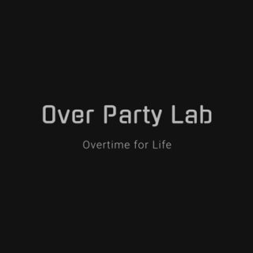

# cocktails-guide-book

[](https://github.com/overpartylab/cocktails-guide-book/graphs/contributors)
[](https://github.com/overpartylab/cocktails-guide-book/releases/tag/v1.0.0-beta.1)
[](https://github.com/overpartylab/cocktails-guide-book/blob/master/LICENSE)

A cocktails search portal create by [Over Party Lab](https://www.instagram.com/over.party.lab/).



* Design: [Design Doc](doc/DESIGN.md)
* User Guide: [User Guide](doc/USER-GUIDE.md)
* Database Doc: [Database Doc](doc/DATABASE-DOC.md)
* Portal: [Over Party Lab Portal v1.0.0-beta.1](https://overpartylab-4c6d2.web.app/)

## Env introduction

We use firebase service to development our service.
* API serverless service: firebase functions
* Web host: firebase hosting
* Realtime database: firebase database

### Folder structure

|Folder   |Function         |
|---------|-----------------|
|app      |web portal       |
|doc      |document         |
|functions|firebase service |
|public   |firebase hosting |
|database |firebase database|
|script   |cicd script      |

## Login with firebase

### Install dependency

```sh
npm install -g firebase-tools
```

### Start to develop

#### login to firebase

Please login with your google account

```sh
firebase login
```

#### Init firebase with existing project
```sh
firebase init
```
choose your project name. ex: ```overpartylab```


## How to deploy our serivces

After login firebase, please run the script <strong>under the script folder</strong>

### Deploy all services
```sh
sh deploy.sh
```

### Deploy api service
```sh
sh deploy-api.sh
```

### Deploy web portal
ex:
```sh
sh deploy-web.sh
```

## Web app

We use React.js to build our webapp. Source code are in /app folder.

### Install dependency

```sh
yarn install
```

### Run the react app in developing mode
```sh
yarn start
```

### Deploy

#### Build react file

```sh
yarn build
```

#### Copy files to firebase/public

```sh
cp -a dist/. ../public
```

#### Deploy by firebase-cli
```sh
firebase deploy --only hosting
```


## API Service

### deploy

deploy by by firebase-cli
```sh
firebase deploy --only functions
```

deploy by single functions
ex:
```sh
firebase deploy --only functions:getAttachedList
```
