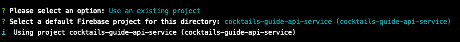

# cocktails-guide-book
A cocktails guide book create by OverPartyLab.

Demo page: [Cocktails Guide Book](https://overpartylab.github.io/cocktails-guide-book/)


## Web app

We use React.js to build our webapp. Source code are in /app folder.

### Install dependency

```sh
yarn install
```
or
```sh
npm install
```

### Run the react app in developing mode
```sh
yarn start
```
or
```sh
npm run start
```

### deploy

* build react file

```sh
yarn build
```
or
```sh
npm run build
```

* copy files to github pages

```sh
cp app/dist docs
```


## API Service

We use firebase functions to be our API serverless service. And firebase database for our database. The database snapshot will save in /database folder.

### Install dependency

```sh
npm install -g firebase-tools
```

### Start to develop

* login to firebase

Please login with OverPartyLab google account

```sh
firebase login
```

* init firebase with existing project
```sh
firebase init functions
```

choose ```cocktails-guide-api-service```



### deploy

deploy only functions
```sh
npm run deploy
```

deploy by single functions
ex:
```sh
firebase deploy --only functions:getAttachedList
```
