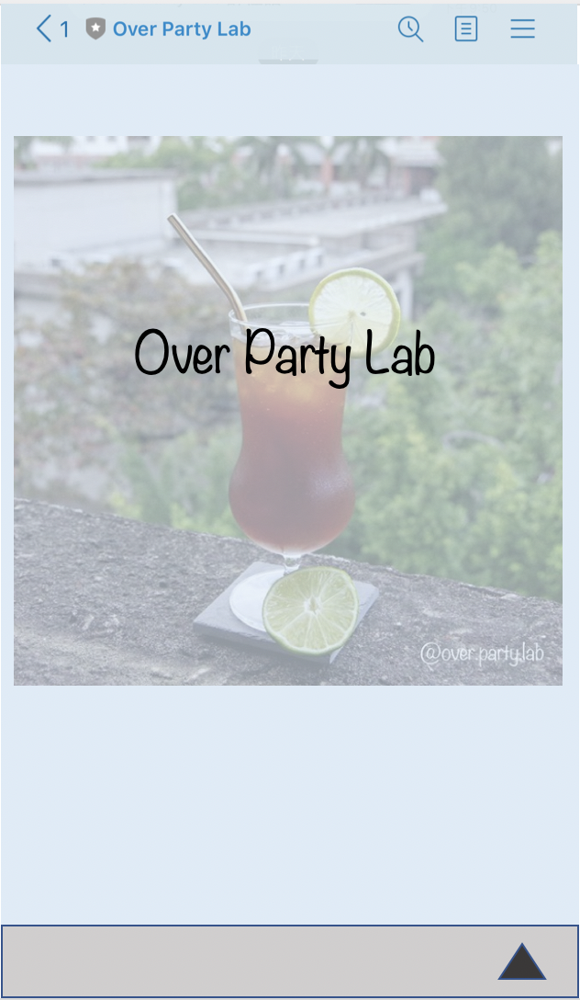
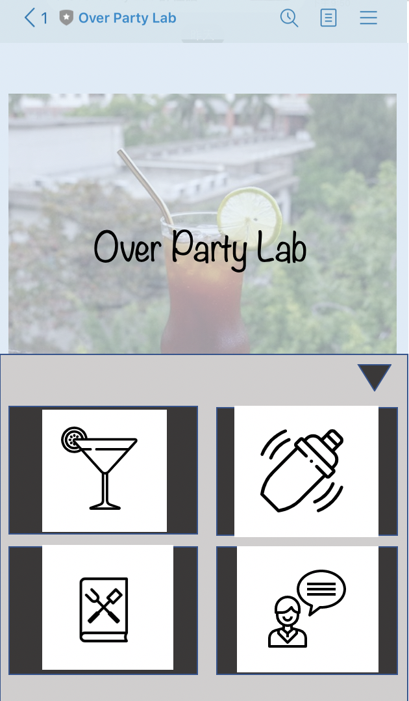
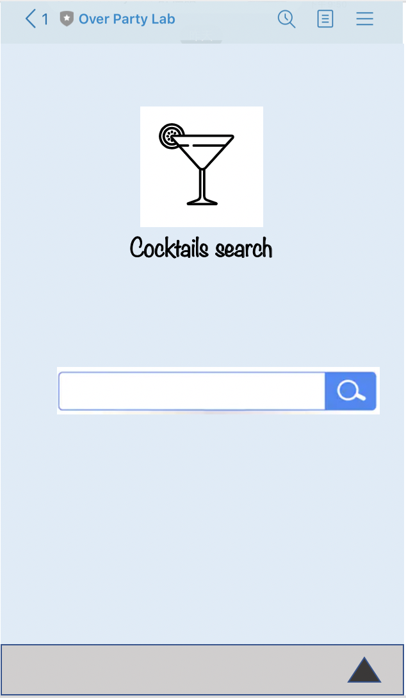
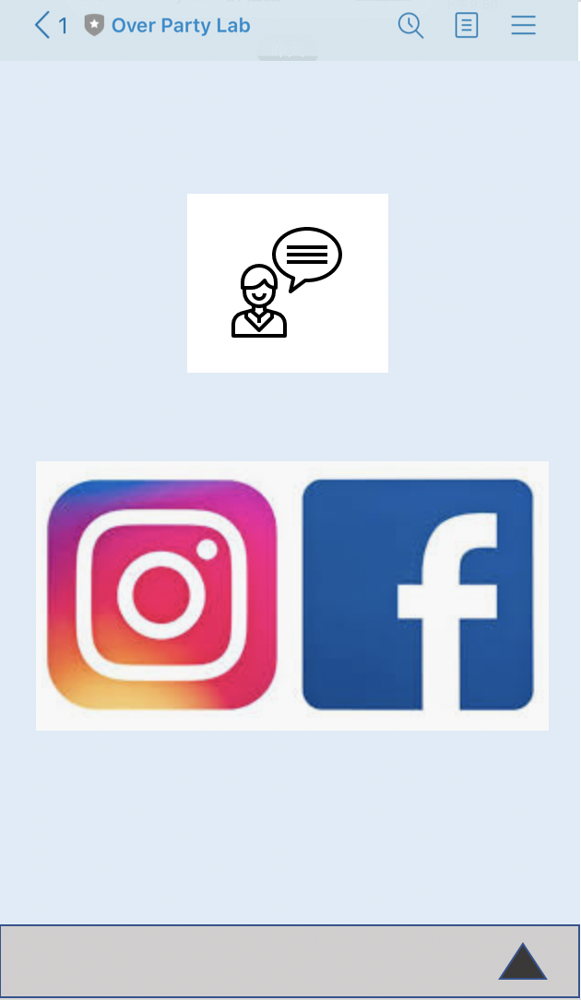

# cocktails-guide-book
A cocktails guide book create by OverPartyLab

## Design

### Scenario
區分使用者為：想在酒吧點酒不知道該喝什麼的人，與想自己在家調酒找酒譜的人。
* OverPartyLab's recipe
* Cocktails search
* Bar surfing around the world (TODO)
* Contact

#### OverPartyLab's recipe
<strong>功能</strong>
1. 初始介面會是我們的酒類清單列表
2. 輸入調酒名稱，輸出酒譜&我們的story
3. 輸入喜好(花香，甜的，水果...)，輸出酒譜&我們的story

#### Cocktails search
<strong>功能</strong>
1. 輸入調酒名稱，輸出酒類介紹(經典調酒)
2. 輸入喜好(花香，甜的，水果...)，輸出推薦調酒

### Technical Stack
使用 Single Page Application 作為 bot 開發的第一步，infra & 邏輯確定再去更動本來的 linebot

* frontend
    * react
* backend
    * google app scripts
* db
    * google sheet

### Table Schema

* over-party-lab-recipe

|Table Name|Column|
|--|--|
|over-party-lab-recipe|recipe_id|
||cocktail_name|
||recipe|
||story|
||url|
||images_url|

* key-word-search

|Table Name|Column|
|--|--|
|key-word-search|key_id|
||key_list|
||recipe_id|
||cocktail_id|

* cocktail-book

|Table Name|Column|
|--|--|
|cocktail-book|cocktail_id|
||cocktail_name|
||story|
||images_url|

### Wireframe

#### Main

#### Menu

Click arrow icon on th bottom, will shows menu

#### Search

View in each page

#### Contact

Contact Page

